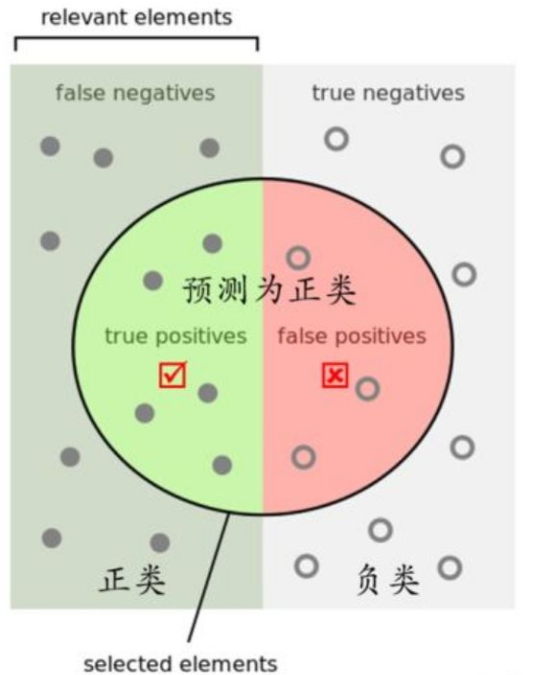
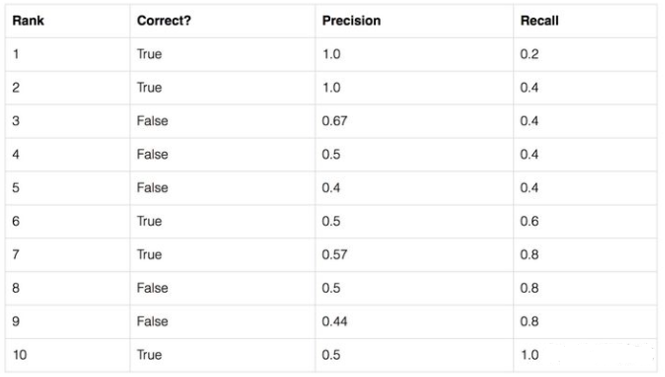
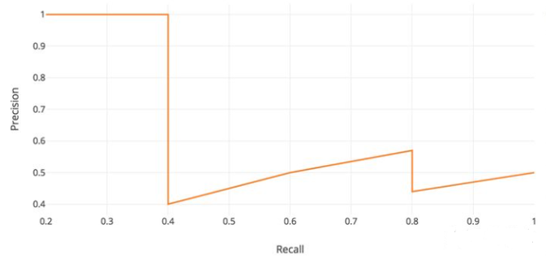
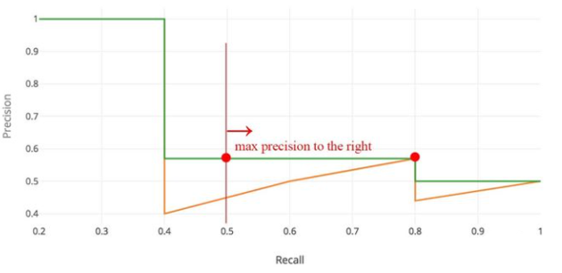
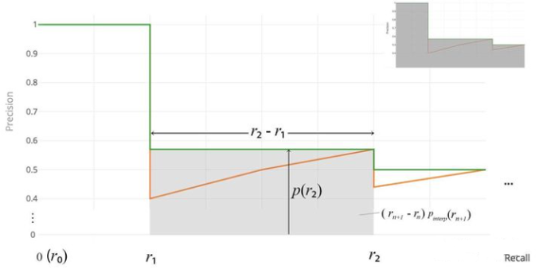

# AP & mAP

- 主流的目标检测评价指标AP （average precision），包含两个部分：

  精准率 precision：检索到的条目中需要的条目占的比例

  召回率 recall：需要的条目有多少比例被检索到

以上实在信息检索中的解释，在目标检测中的解释为：

若干待检测的目标，precision为检测出来的结果中有多大的比例是真正的物体，recall为所有真实的物体有多少比例被模型检测出来

- 计算方法

  
  
  |                       | 检测框的置信度大于阈值t（模型检测为物体） | 检测框的置信度小于阈值t（模型检测不是物体） |
  | --------------------- | ----------------------------------------- | ------------------------------------------- |
  | iou>0.5 with gt       | TP                                        | TN                                          |
  | iou < 0.5 with all gt | FP                                        | FN                                          |


$$
precision = \frac{TP}{TP + FP}
$$

$$
recall = \frac{TP}{TP + FN}
$$

- PR（precision-recall）曲线

  期望是P和R都是越高越好，但某些场景下二者是矛盾的，如只检测到一个结果且准确的，precision就是100%，recall就很低，如果把所有的anchor都返回，recall必然很大，precision就很低

  - PR曲线计算步骤

    - 根据检测的confidence将结果进行排序

    - 通过计算``` iou(result, gt)```判断检测结果是否正确

    - 计算precision和recall

      

  -	以recall为横轴，precision为纵轴，可以获得PR曲线，precision和recall负相关，局部区域会上下波动

  
  
- AP（average precision），平均精准度，对pr曲线上的precision求平均，一个积分求和 ==>面积求和取平均：
  $$
  AP = \int_{0}^{1}p(r)dr
  $$
  实际操作会对曲线进行平滑：PR曲线上的每个点，取值都是其右侧最大值。
  $$
  P_{smooth}(r) = \max\limits_{r^`>r}P(r^`)
  $$
  

  
- Interplolated AP(pascal voc 2008的AP计算方法)

  IoU=0.5，平滑的PR曲线上，取横轴0-1的10等分点（包括断点共11个点）的Precision的值，计算其平均值为最终AP的值。
  
- Area under curve

  上述方法有两个缺陷，第一个是使用11个采样点在精度方面会有损失，第二个是在比较两个AP值较小的模型时，很难体现出两者的差别。所以这种方法在2009年的Pascalvoc之后便不再采用了。在Pascal voc 2010之后，便开始采用这种精度更高的方式。

  绘制出平滑后的PR曲线后，用积分的方式计算平滑曲线下方的面积作为最终的AP值。

  

- CoCo mAP

  目前使用的比较多的方式，pr曲线上采样100个点，，并且iou阈值不再固定0.5，而是0.5：0.05：0.95计算得到的每一个AP取平均。通常来说AP是在单个类别下的，mAP是AP值在所有类别下的均值。在这里，在coco的语境下AP便是mAP，这里的AP已经计算了所有类别下的平均值，这里的AP便是mAP

  | 符号            | 解释                                    |
  | --------------- | --------------------------------------- |
  | AP              | iou=0.5:0.05:0.95                       |
  | AP<sub>50</sub> | iou=0.5                                 |
  | AP<sub>75</sub> | iou=0.75                                |
  | AP<sub>S</sub>  | 像素面积小于32x32的目标框的AP测量值     |
  | AP<sub>M</sub>  | 像素面积在32x32-96x96之间目标框的测量值 |
  | AP<sub>L</sub>  | 像素面积大于96x96的目标框的AP测量值     |


